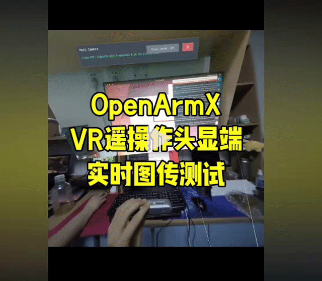

# OpenArmX 头部视觉使用说明

[English](./README.md) | 中文

---




本包用于把相机画面发送到 VR 端。当前分两种相机链路：

- RealSense D435/D435i：只作为单目彩色相机使用。
- RealSense D405/D435/D435i 腕部相机：可分别发送左手和右手画面。
- 独立 USB 双目相机：使用左右拼接图，ROS 端拆成左眼和右眼两路发送。

RealSense 不作为双目相机使用。

## 准备

```bash
cd ~/openflex_all/openflex_ws
source install/setup.bash
```

如果修改过代码，先编译：

```bash
colcon build --packages-select openarmx_head_vision_h264
source install/setup.bash
```

## RealSense 单目

默认启动 RealSense 彩色相机，并发送到 VR：

```bash
ros2 launch openarmx_head_vision_h264 d435i_vr.launch.py
```

指定 RealSense 序列号：

查看相机 ID：

```bash
rs-enumerate-devices -s
```

输出中的 `Serial Number` 就是相机 ID，例如：

```text
Device Name                   Serial Number
Intel RealSense D435          150622072782
```

```bash
ros2 launch openarmx_head_vision_h264 d435i_vr.launch.py serial_number:=150622072782
```

自定义分辨率：

```bash
ros2 launch openarmx_head_vision_h264 d435i_vr.launch.py \
  config_mode:=custom \
  color_width:=1280 \
  color_height:=720 \
  color_fps:=30
```

VR 端参数：

- `enable_stereo`: `false`
- 端口：`5600`

## 左右手腕相机

`d435i_vr.launch.py` 可同时启动头部和左右手腕相机。腕部相机序列号默认从
`~/.openflex/cameras_config.yaml` 的 `cameras.left_wrist` 和
`cameras.right_wrist` 读取：

```bash
ros2 launch openarmx_head_vision_h264 d435i_vr.launch.py \
  enable_head_video:=true \
  enable_hand_video:=true
```

也可以只发送左右手：

```bash
ros2 launch openarmx_head_vision_h264 wrist_cameras_vr.launch.py
```

端口固定为：头部 `5600`、左手 `5601`、右手 `5602`。控制指令端口为 `5100`。

## USB 双目相机

独立双目相机输入是一张左右拼接图，例如 `3840x1080`，ROS 端会拆成：

- 左眼：`/vision/stereo/left/image_raw`
- 右眼：`/vision/stereo/right/image_raw`

启动：

```bash
ros2 launch openarmx_head_vision_h264 usb_stereo_side_by_side_vr.launch.py
```

指定设备和端口：

```bash
ros2 launch openarmx_head_vision_h264 usb_stereo_side_by_side_vr.launch.py \
  ros_ip:=0.0.0.0 \
  video_device:=auto \
  image_width:=2560 \
  image_height:=720 \
  udp_port:=5600 \
  bitrate:=6000 \
  framerate:=30 \
  camera_fps:=120
```

`video_device:=auto` 会自动选择支持当前拼接分辨率的双目相机，例如默认 `1280x480`。
`camera_fps` 是相机采集帧率，默认 `30`；`framerate` 是发送到 VR 的目标帧率，默认 `15`。

VR 端参数：

- `enable_stereo`: `true`
- 左右拼接双目视频端口：`5600`

该模式使用单路左右拼接图，不使用 `5601`。`5601` 和 `5602` 保留给左右手腕视频。

## 只转发已有图像话题

如果已有 ROS 图像话题，可以只启动视频转发器：

```bash
ros2 launch openarmx_head_vision_h264 vr_forwarder_only.launch.py \
  image_topic:=/vision/color/image_raw \
  udp_port:=5600
```

## 查看主机 IP

```bash
hostname -I
```

VR 端填写运行 ROS 的电脑 IP。

## 正常日志

收到 VR 连接后会看到：

```text
VR UDP client registered from <vr_ip>:<port>
```

发送正常时统计会增长：

```text
Stats: Recv=... Enc=... Sent=... Pkts=... Hello=... Client=...
```

如果 `Recv` 增长但 `Enc/Sent` 不增长，通常是 VR 没有连上或端口不对。

## 许可证

本作品采用知识共享 署名-非商业性使用-相同方式共享 4.0 国际许可协议 (CC BY-NC-SA 4.0) 进行许可。

版权所有 (c) 2026 成都长数机器人有限公司 (Chengdu Changshu Robot Co., Ltd.)

详情请参阅 [LICENSE_CN.md](LICENSE) 文件或访问：http://creativecommons.org/licenses/by-nc-sa/4.0/

## 致谢

本包是 OpenArmX 机器人平台生态系统的一部分，专为协作机器人领域的研究和工业应用而开发。

---

## 📞 联系我们

### 成都长数机器人有限公司
**Chengdu Changshu Robotics Co., Ltd.**

| 联系方式 | 信息 |
|---------|------|
| 📧 邮箱 | openarmrobot@gmail.com |
| 📱 电话/微信 | +86-17746530375 |
| 🌐 官网 | <https://openarmx.com/> |
| 🌐 文档 | <http://docs.openarmx.com/> |
| 📍 地址 | 天津经济技术开发区西区新业八街11号华诚机械厂 |
| 👤 联系人 | 王先生 |
